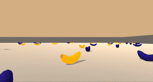
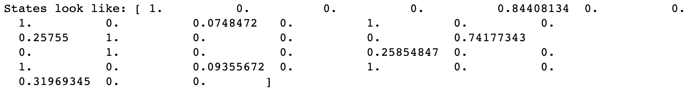

# Submission for Project 1 of Udacity DRLND: Navigation

## Introduction
In this project, we will train an agent to navigate and collect bananas in a Unity environment.  
  

### Reward Structure
The agent is free to move in in X and Y within a bounded square environment. In this environment, it encounters blue and yellow bananas. Collecting a yellow banana results in a reward of +1, whereas a blue banana gives a reward of -1. In maximising return, it is therefore our agent's goal to collect as many yellow bananas as possible, whilst avoiding the blue ones.

### State and Action Space
The state space is a 37-dimensional vector and the values within this vector are continuous. This is an example of a state vector:
 
The action space is discrete and contains 4 actions:
- ```0```: move forward
- ```1```: move backward
- ```2```: turn left
- ```3```: turn right

The state space has 37 dimensions and contains the agent's velocity, along with ray-based perception of objects around agent's forward direction. Given this information, the agent has to learn how to best select actions. Four discrete actions are available, corresponding to:

The README describes the the project environment details (i.e., the state and action spaces, and when the environment is considered solved).

The README has instructions for installing dependencies or downloading needed files.

The README describes how to run the code in the repository, to train the agent

My submission for the Navigation (p1) project part of the Udacity Deep Reinforcement Learning nanodegree.


